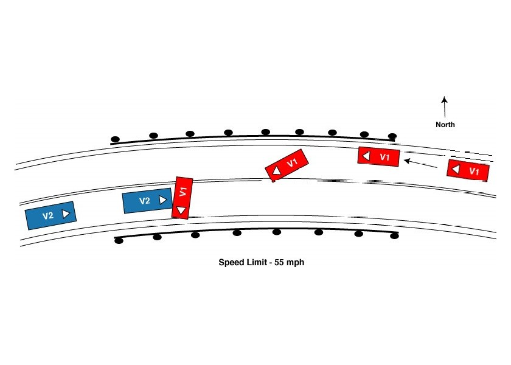
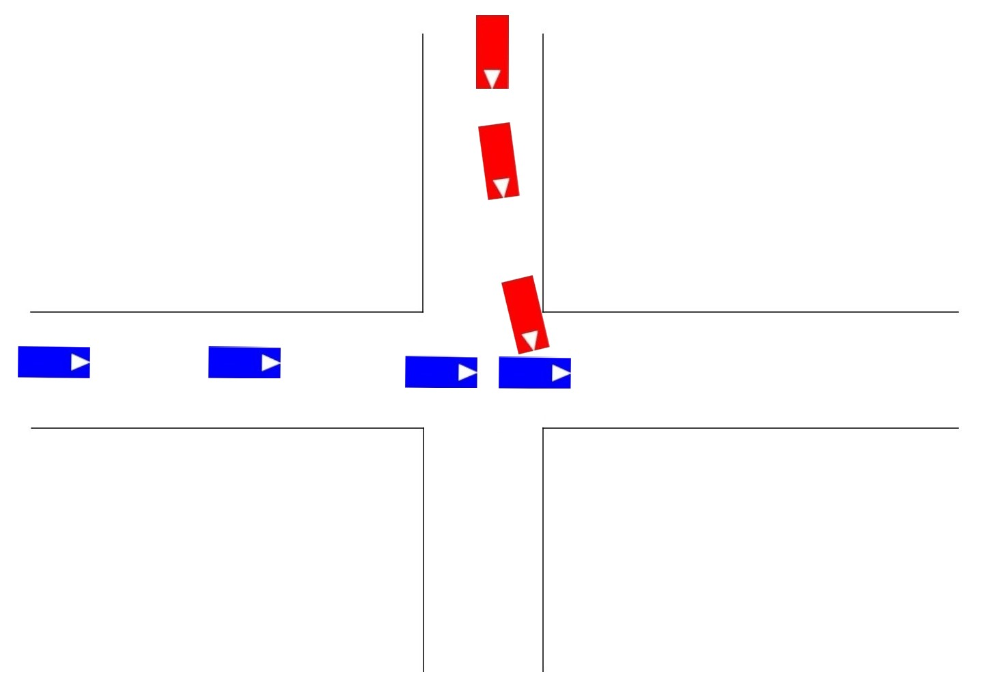

# CRISCE: Automatically Generating Critical Driving Scenarios From Car Accident Sketches

This document describes how to install and use CRISCE (CRItical SCEnario), the tool developed by Jasim Ahmed and others for automatically generate simulations of car crashed from accident sketches using [BeamNG.tech](https://beamng.tech/).

A video demonstration of the tool is available on [YouTube](https://youtu.be/G8GJl4wTchI).

## Repo Organization

```
.
├── Datasets
│   ├── CIREN
│   └── SYNTH
├── LICENSE
├── PythonRobotics
├── README.md
├── beamngpy-1.18-py2.py3-none-any.whl
├── crisce
└── requirements.txt
```

The `crisce` folder contains the source code of the tool.
The `Datasets` folder contains the sample accident sketches compatible with the tool: `CIREN` contains sketches from [NHTSA](https://crashviewer.nhtsa.dot.gov/LegacyCIREN/Search); `SYNT` contains synthetic sketches that we manually created from pre-existing car crash simulations in BeamNG.tech.

`beamngpy-1.18-py2.py3-none-any.whl` is the wheel file necessary to manually install `beamngpy` the Python API to BeamNG.tech. Tl;DR: The package available on pypi is broken.

`requirements.txt` lists the python packages needed to install the tool. They are in the usual format accepted by `pip`.

## Dependencies
CRISCE is a tool written in Python, therefore it requires a working Python installation. Specifically, we tested CRISCE with `Python 3.7.10`

CRISCE uses the BeamNG.tech simulator to run the driving simulations. Therefore, BeamNG.tech must be installed as well. 

> Note: the version of the simulator used by CRISCE is `BeamNG.research v1.7.0.1`

BeamNG.tech is free for research use and can be requested to BeamNG.GmbH by submitting the form at the following link: [https://register.beamng.tech/](https://register.beamng.tech/)

> NOTE: BeamNG.tech currently supports only Windows, hence CRISCE cannot be used on other platforms (e.g., Linux/Mac) unless you can resort to full system virtualization. For example, we tested CRISCE using the commercial tool Parallels Desktop running on a Mac Book Pro. Performance will not be the same but at least it gets the job done.

## Installation

### Installing BeamNG.tech
After successfully registered to [https://register.beamng.tech/](https://register.beamng.tech/), you should receive an email with the instructions to access the software and a registration key (i.e., `tech.key`).

Please download the `BeamNG.research v1.7.0.1` and unzip it somewhere in your system. 

> ATTENTION: BeamNG cannot handle paths with spaces and special characters, so please install it in a location that matches these requirements. We suggest something simple, like `C:\BeamNG.research_v1.7.0.1`.

We refer to this folder as `<BEAMNG_HOME>`

Store a copy of the `tech.key` file in a folder somewhere in your system and rename this copy to `research.key`. BeamNG use this folder to cache the content and the simulation data. 

> ATTENTION: BeamNG cannot handle paths with spaces and special characters, so please store the registration file in a location that matches these requirements. We suggest something simple, like `C:\BeamNG_user`.

We refer to this folder as `<BEAMNG_USER>`

### Installing CRISCE and its Dependencies

We exemplify the installation and usage of CRISCE using Windows Powershell; you can use other systems (e.g., PyCharm) but in that case you need to adapt the commands below.

Before starting, check that you have installed the right version of Python:

```
python.exe -V
    Python 3.7.10
```

To install CRISCE we suggest creating a virtual environment using `venv`. You can also use `conda` or similar, but in this case you need to adapt the command below to fit your case.

Move to CRISCE's root folder (i.e., where this file is) and create a new virtual environment:

```
python.exe -m venv .venv
```

Activate the virtual environment and upgrade `pip`, `setup tools` and `wheel`.

```
.venv\Scripts\activate
py.exe -m pip install --upgrade pip
pip install setuptools wheel --upgrade
```

Install the python dependencies listed in the `requirements.txt`:

```
pip install -r requirements.txt
```

At this point, we need to install `beamingly` from the provided wheel file:

```
pip install beamngpy-1.18-py2.py3-none-any.whl
```

Finally, we need to make sure the code of `PythonRobotics` is there:

```
git submodule init
git submodule update
```

At this point, you should be ready to go.

Confirm that CRISCE is installed using the following command from the root folder of this repo:

```
py.exe crisce/app.py --help
```

This command must produce an output similar to:

```
Usage: app.py [OPTIONS] COMMAND [ARGS]...

Options:
  --log-to PATH  Location of the log file. If not specified logs appear on the
                 console
  --debug        Activate debugging (results in more logging)  [default:
                 (Disabled)]
  --help         Show this message and exit.

Commands:
  generate
```

### Running CRISCE
The current release of CRISCE allows to generate a BeamNG simulation of a car crash from a single sketch using the command `generate`. This command accepts several parameters that you can list by invoking:

```
py.exe crisce/app.py generate --help

Usage: app.py generate [OPTIONS]

Options:
  --accident-sketch PATH        Input accident sketch for generating the
                                simulation  [required]
  --dataset-name [CIREN|SYNTH]  Name of the dataset the accident comes from.
                                [required]
  --output-to PATH              Folder to store outputs. It will created if
                                not present. If omitted we use the accident
                                folder.
  --beamng-home PATH            Home folder of the BeamNG.research simulator
                                [required]
  --beamng-user PATH            User folder of the BeamNG.research simulator
                                [required]
  --help                        Show this message and exit.
```

The following commands show how you can generate a simulation of a real car crash (i.e., from a sketch in the CIREN dataset) and from a simulated crash (i.e., from a sketch in the SYNTH dataset). The difference between the two dataset is that for sketches of real car crashes, we have information about the expected impact; while, for synthetic sketches the information is missing.

For example, to create a simulation form the following sketch (i.e., CIREN-99817):



you can run the following command (after replacing `<BEAMNG_HOME>` and `<BEAMNG_USER>` with the appropriate values:

```
py.exe crisce/app.py generate generate --accident-sketch .\Datasets\CIREN\99817\ --dataset-name CIREN --beamng-home `<BEAMNG_HOME>` --beamng-user <BEAMNG_USER>
```

To create a simulation form the following synthetic sketch (i.e., fourway_1):


you can run the following command:

```
py.exe crisce/app.py generate generate --accident-sketch ./Datasets/SYNTH/fourway_1 --dataset-name SYNTH --beamng-home `<BEAMNG_HOME>` --beamng-user <BEAMNG_USER>
```

### Reporting

The `generate` command produces a number of intermediate outputs that show the progress of the computation and measure the accuracy of the simulation that is printed on the console:

```
Quality_of_environment = 33.0, quality_of_crash = 17.0, quality_of_trajecory = 19.009199327937655
Crash Simulation Accuracy =  69.00919932793765 %
```

The intermediate results instead are stored under the sketch folder (under `output`) or the folder configured via the `--output-to` parameter.

For the case CIREN-99817 for example, those are the intermediate results produced by CRISCE:

```
output/
├── car
│   ├── 0_mask_result_b.jpg
│   ├── 0_mask_result_r.jpg
│   ├── 1_blend_masks_r_b.jpg
│   ├── 1_blend_masks_res.jpg
│   ├── 2_opening_morph.jpg
│   ├── 3_AABB_OBB.jpg
│   ├── 4_crash_point_visualization.jpg
│   ├── 5_triangle_extraction.jpg
│   ├── 6_angles_for_vehicles.jpg
│   ├── 7_sequence_of_movements.jpg
│   ├── 8_twelve_point_model_sides.jpg
│   └── 9_crash_point_on_vehicles.jpg
├── kinematics
│   ├── 0_distorted_control_points.jpg
│   ├── 1_distorted_control_points.jpg
│   ├── 2_distorted_trajectory.jpg
│   ├── 2_original_trajectory.jpg
│   ├── 3_distorted_trajectory.jpg
│   └── 3_original_trajectory.jpg
├── road
│   ├── 0_gray_image.jpg
│   ├── 1_blur_image.jpg
│   ├── 2_threshold_image.jpg
│   ├── 3_dilate_image.jpg
│   ├── 4_erode_image.jpg
│   ├── 5_Contour_Viz_image.jpg
│   ├── 6_midpoints_of_lane.jpg
│   ├── 7_distortion_mapping.jpg
│   └── 8_final_result.jpg
├── simulation
│   ├── 0_sim_plot_road.jpg
│   ├── 1_sim_initial_pos_dir.jpg
│   ├── 2_sim_bbox_traj.jpg
│   ├── 3_crisce_beamng_efficiency.jpg
│   ├── 3_crisce_efficiency.jpg
│   └── 4_trace_veh_BBOX.jpg
└── summary.json
```


